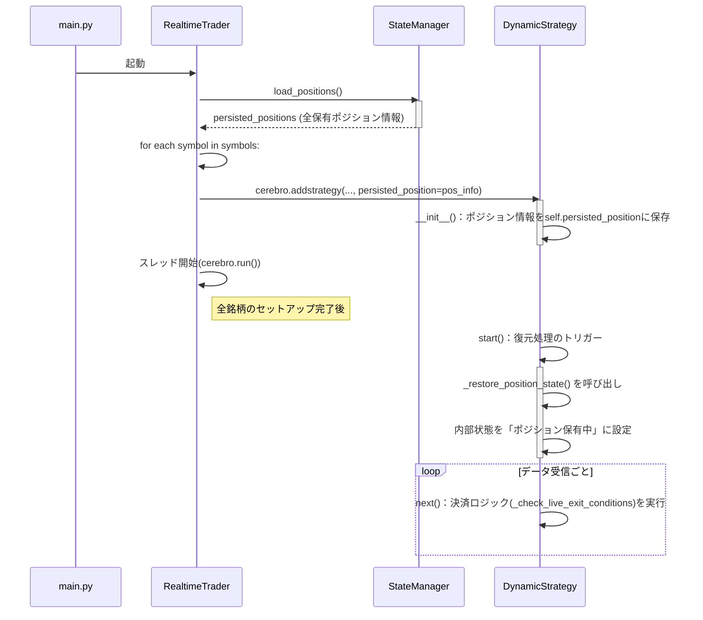

## **詳細設計書: 状態復元機能**

### **1. 概要**

#### **1.1. 目的**

本設計書は、リアルタイム自動トレードシステムの起動時に、前回のセッションから持ち越したポジション情報をデータベース（DB）から読み込み、取引セッションに正しく復元するための実装詳細を定義する。

これにより、システムが意図せず停止（クラッシュ、再起動など）した場合でも、ポジションと関連する決済ロジックを継続して管理できるようになり、システムの堅牢性を向上させる。

#### **1.2. 設計対象**

本設計で修正・追加を行う主要なコンポーネントは以下の通り。

  * `src/realtrade/run_realtrade.py`: 起動シーケンスの制御
  * `src/core/strategy.py`: 戦略クラス内での状態復元と決済ロジックの再設定

#### **1.3. 前提条件**

  * `results/realtrade/realtrade_state.db` に、`state_manager.py` によって保存された有効なポジション情報（銘柄、サイズ、エントリー価格、エントリー日時）が存在する。
  * 本機能はライブトレードモード (`LIVE_TRADING=True`) でのみ動作する。

-----

### **2. 全体シーケンス**

システムの起動からポジション復元、通常取引への移行までの処理フローは以下の通りです。



### **3. 各コンポーネントの修正詳細**

#### **3.1. `src/realtrade/run_realtrade.py` の修正**

##### **`RealtimeTrader.__init__`**

`state_manager` の初期化直後に、DBから全ポジション情報を一括で読み込み、インスタンス変数に保持します。

```python
# src/realtrade/run_realtrade.py

class RealtimeTrader:
    def __init__(self):
        # ... (既存の初期化処理)
        self.state_manager = StateManager(os.path.join(config.BASE_DIR, "results", "realtrade", "realtrade_state.db"))
        # ▼▼▼ 追加 ▼▼▼
        self.persisted_positions = self.state_manager.load_positions()
        if self.persisted_positions:
            logger.info(f"DBから{len(self.persisted_positions)}件の既存ポジションを検出しました。")
        # ▲▲▲ 追加 ▲▲▲
        self.threads = []
        self.cerebro_instances = []
```

##### **`RealtimeTrader._create_cerebro_for_symbol`**

戦略クラス (`DynamicStrategy`) にインスタンスを生成する際、その銘柄に対応するポジション情報をキーワード引数で渡します。

```python
# src/realtrade/run_realtrade.py

    def _create_cerebro_for_symbol(self, symbol):
        # ... (既存の処理)

        # ▼▼▼ 修正 ▼▼▼
        # symbolは文字列型として扱う
        symbol_str = str(symbol)
        persisted_position = self.persisted_positions.get(symbol_str)
        if persisted_position:
            logger.info(f"[{symbol_str}] の既存ポジション情報を戦略に渡します: {persisted_position}")

        cerebro.addstrategy(btrader_strategy.DynamicStrategy,
                            strategy_params=strategy_params,
                            live_trading=config.LIVE_TRADING,
                            persisted_position=persisted_position) # persisted_position引数を追加
        # ▲▲▲ 修正 ▲▲▲
        
        cerebro.addanalyzer(TradePersistenceAnalyzer, state_manager=self.state_manager)
        return cerebro
```

#### **3.2. `src/core/strategy.py` (`DynamicStrategy`) の修正**

##### **パラメータの追加**

`bt.Strategy.params` に `persisted_position` を追加し、`run_realtrade` から状態情報を受け取れるようにします。

```python
# src/core/strategy.py

class DynamicStrategy(bt.Strategy):
    params = (
        ('strategy_params', None),
        # ... (既存のパラメータ)
        ('live_trading', False),
        ('persisted_position', None), # ▼▼▼ 追加 ▼▼▼
    )
```

##### **`__init__` メソッドの修正**

渡された `persisted_position` をインスタンス変数に保存します。また、復元処理中であることを示すフラグを追加します。

```python
# src/core/strategy.py

    def __init__(self):
        # ... (既存の処理)
        self.current_position_entry_dt = None
        self.live_trading_started = False
        
        # ▼▼▼ 追加 ▼▼▼
        self.is_restoring = self.p.persisted_position is not None
        # ▲▲▲ 追加 ▲▲▲
```

##### **`start` メソッドの修正**

`start` メソッドは、データフィードが開始され、インジケーターの最小期間が満たされる前に呼ばれるため、実際の復元処理はここではなく `next` メソッド内で行うのが安全です。`start` ではログ出力のみ行います。

```python
# src/core/strategy.py

    def start(self):
        self.live_trading_started = True
        # ▼▼▼ 追加 ▼▼▼
        if self.is_restoring:
            self.log(f"状態復元モードで開始。ポジション情報: {self.p.persisted_position}")
        # ▲▲▲ 追加 ▲▲▲
```

##### **`next` メソッドの修正**

`next` メソッドの冒頭に、状態を復元するためのロジックを追加します。この処理は一度だけ実行されるようにします。

```python
# src/core/strategy.py

    def _restore_position_state(self):
        """ポジション情報をブローカーと戦略の状態に反映させる"""
        pos_info = self.p.persisted_position
        size = pos_info['size']
        price = pos_info['price']

        # Backtraderのブローカーにポジションを通知
        self.broker.setposition(self.data, size, price)
        
        # 決済価格を再計算
        self._recalculate_exit_prices()

        self.log(f"ポジション復元完了。Size: {size}, Price: {price}, SL: {self.sl_price:.2f}, TP: {self.tp_price:.2f}")

    def _recalculate_exit_prices(self):
        """復元されたポジションに対する決済価格を計算する"""
        exit_conditions = self.strategy_params.get('exit_conditions', {})
        sl_cond = exit_conditions.get('stop_loss')
        tp_cond = exit_conditions.get('take_profit')
        entry_price = self.getposition().price

        if sl_cond:
            sl_atr_key = self._get_indicator_key(sl_cond['timeframe'], 'atr', {k: v for k, v in sl_cond['params'].items() if k != 'multiplier'})
            atr_val = self.indicators.get(sl_atr_key)[0]
            if atr_val and atr_val > 1e-9:
                self.risk_per_share = atr_val * sl_cond['params']['multiplier']
                self.sl_price = entry_price - self.risk_per_share if self.getposition().size > 0 else entry_price + self.risk_per_share

        if tp_cond:
            tp_atr_key = self._get_indicator_key(tp_cond['timeframe'], 'atr', {k: v for k, v in tp_cond['params'].items() if k != 'multiplier'})
            atr_val = self.indicators.get(tp_atr_key)[0]
            if atr_val and atr_val > 1e-9:
                tp_multiplier = tp_cond['params']['multiplier']
                self.tp_price = entry_price + atr_val * tp_multiplier if self.getposition().size > 0 else entry_price - atr_val * tp_multiplier

    def next(self):
        # ... (既存の冒頭チェック)
        if len(self.data) == 0 or not self.live_trading_started or self.data.volume[0] == 0:
            return
            
        # ▼▼▼ 追加 ▼▼▼
        # 復元処理（初回のみ実行）
        if self.is_restoring:
            try:
                self._restore_position_state()
            except Exception as e:
                self.log(f"ポジション復元に失敗しました: {e}", logging.CRITICAL)
                # 復元に失敗した場合、安全のため以降の処理を停止
                self.is_restoring = False 
                return
            # 復元が完了したらフラグをFalseにし、二度と実行されないようにする
            self.is_restoring = False
        # ▲▲▲ 追加 ▲▲▲

        if self.entry_order or (self.live_trading and self.exit_orders):
            return
            
        if self.getposition().size:
            if self.live_trading:
                self._check_live_exit_conditions()
            return
            
        self._check_entry_conditions()
```

##### **`BackBroker.setposition` メソッドの追加** (概念)

`DynamicStrategy._restore_position_state` で使用している `self.broker.setposition` は、Backtraderの標準ブローカーには存在しないため、`bt.brokers.BackBroker` を継承したカスタムブローカーを作成するか、ブローカーの状態を直接更新するヘルパーを `run_realtrade.py` で定義し、`cerebro` にセットする必要があります。

しかし、よりシンプルで安全な方法は、ブローカーの状態を直接操作せず、**戦略クラスが「ポジションを保有している」と認識する**ことです。以下にその代替案を示します。

##### **代替案: `strategy.py` の修正 (推奨)**

ブローカーを直接操作する代わりに、戦略の内部状態を更新し、決済ロジックのみを有効化します。このアプローチの方が安全です。

**`_restore_position_state` の修正:**

```python
# src/core/strategy.py

    def _restore_position_state(self):
        """戦略の内部状態を「ポジション保有中」として初期化する"""
        pos_info = self.p.persisted_position
        
        # 決済価格を計算するために、エントリー価格とサイズを一時的に設定
        self.entry_price_restored = pos_info['price']
        self.size_restored = pos_info['size']

        # 決済価格を再計算
        self._recalculate_exit_prices(entry_price=self.entry_price_restored, is_long=(self.size_restored > 0))

        # トレード情報を手動で更新（notify_tradeを模擬）
        self.position.size = self.size_restored
        self.position.price = self.entry_price_restored
        self.current_position_entry_dt = datetime.fromisoformat(pos_info['entry_datetime'])

        self.log(f"ポジション復元完了。Size: {self.position.size}, Price: {self.position.price}, SL: {self.sl_price:.2f}, TP: {self.tp_price:.2f}")

    def _recalculate_exit_prices(self, entry_price, is_long):
        # ... (既存の再計算ロジック) ...
        # self.getposition() を使わず、引数で渡された情報で計算する
        # 例: self.sl_price = entry_price - self.risk_per_share if is_long else entry_price + self.risk_per_share
```

**`next` メソッドの修正:**
上記の `_restore_position_state` を呼び出すように修正します。

```python
# src/core/strategy.py

    def next(self):
        # ...

        if self.is_restoring:
            try:
                # インジケーターが計算されるまで待つ
                if len(self.indicators.get(self._get_atr_key_for_exit('stop_loss'))) > 0:
                     self._restore_position_state()
                     self.is_restoring = False # 復元完了
                else:
                    return # ATRがまだ計算されていないので待機
            except Exception as e:
                # ... エラー処理 ...
                self.is_restoring = False
                return
```

※ `_get_atr_key_for_exit` は、決済条件からATRインジケーターのキーを取得するヘルパー関数（要実装）です。

-----

### **4. エラーハンドリング**

  * **DBと口座の不整合**: 現状の `yfinance` ベースの実装では、実際の口座ポジションを取得できません。したがって、「DBの情報が正」であると仮定します。将来的に証券会社APIを使用する場合は、DBと口座情報を照合し、不整合があればCRITICALレベルのログを出力して手動介入を促す機能を追加すべきです。
  * **復元失敗**: `_restore_position_state` 内で`try-except`ブロックを設け、復元に失敗した場合はエラーログを記録し、当該銘柄の取引を行わないようにします。

-----

### **5. テストケース**

本機能の実装後、以下のテストを実施し、正常に動作することを確認します。

1.  **通常起動**: `realtrade_state.db` にポジション情報がない状態でシステムを起動し、エラーなく通常通りに動作することを確認。
2.  **単一ポジションの復元**:
      * 買い（または売り）ポジションを1つ保有した状態でシステムを正常に停止。
      * `realtrade_state.db` にポジション情報が記録されていることを確認。
      * システムを再起動し、起動ログにポジション復元のメッセージが出力されることを確認。
      * `next` メソッドでエントリーロジックが実行されず、決済監視ロジック (`_check_live_exit_conditions`) のみが実行されることをログで確認。
3.  **復元後の決済**:
      * ポジション復元後、手動またはシミュレーションで価格を動かし、TP（利確）またはSL（損切り）価格に達した際に、`self.close()` が呼ばれ、決済注文が実行されることを確認。
      * 決済後、`state_manager` によってDBからポジション情報が削除されることを確認。
4.  **複数ポジションの復元**: 異なる銘柄で複数のポジションを保有した状態で再起動し、すべてのポジションが各戦略インスタンスで正しく復元・管理されることを確認。

-----
-----

## **詳細設計書(改訂版): 状態復元機能**

### **1. 概要**

#### **1.1. 目的**

本設計書は、リアルタイム自動トレードシステムの起動時に、前回のセッションから持ち越したポジション情報をデータベース（DB）から読み込み、取引セッションに正しく復元するための実装詳細を定義する。

**今回の改訂では、テストで発見された`IndexError`を解決するため、Backtraderのライフサイクルを考慮し、データアクセスを伴う処理を`start()`メソッドから`next()`メソッドへ完全に移行する。**

#### **1.2. 設計対象**

  * `src/core/strategy.py`: 戦略クラス内での状態復元と決済ロジックの再設定

-----

### **2. 全体シーケンス (変更なし)**

システムの起動からポジション復元、通常取引への移行までの処理フローは、前回の設計書から変更ありません。

### **3. 各コンポーネントの修正詳細**

#### **3.1. `src/core/strategy.py` (`DynamicStrategy`) の修正**

##### **`start` メソッドの修正**

[cite\_start]**問題点**: `start()`メソッド実行時点ではデータ配列が空のため、`self.log()`内で`self.data.datetime`にアクセスすると`IndexError`が発生する。 [cite: 10, 11, 21, 22]

**対策**: `start()`メソッドからは、データアクセスを伴う処理を完全に削除します。このメソッドは、取引ループ開始前のフラグ設定のみに責任を持つようにします。

```python
# src/core/strategy.py

# ... (クラス定義)

    def start(self):
        """
        取引ループ開始前に一度だけ呼ばれる。
        データアクセスはここでは行わない。
        """
        self.live_trading_started = True
        # ▼▼▼ 修正 ▼▼▼
        # データ未ロードの段階で呼び出すとエラーになるため、ログ出力を削除。
        # if self.is_restoring:
        #    self.log(f"状態復元モードで開始。ポジション情報: {self.p.persisted_position}")
        # ▲▲▲ 修正 ▲▲▲
```

\<br/\>

##### **`_restore_position_state` メソッドの修正**

**問題点**: 前回の設計では、このメソッド内でログを呼び出していました。ログ出力の責務を明確化します。

**対策**: このメソッドは状態の復元と決済価格の計算に専念させ、ログ出力は呼び出し元の`next()`メソッドで行うようにします。ただし、現在の実装では既に`next()`から呼び出されるログで十分な情報が出力されるため、このメソッド内のログは維持しても問題ありません。設計をよりクリーンにするため、ここでは責務の分離を明確化します。

```python
# src/core/strategy.py

    def _restore_position_state(self):
        """戦略の内部状態を「ポジション保有中」として初期化する"""
        pos_info = self.p.persisted_position
        size, price = pos_info['size'], pos_info['price']

        self.position.size = size
        self.position.price = price
        self.current_position_entry_dt = datetime.fromisoformat(pos_info['entry_datetime'])

        self._recalculate_exit_prices(entry_price=price, is_long=(size > 0))

        # ▼▼▼ 修正 ▼▼▼
        # このログはnext()のコンテキストで呼ばれるため安全。
        # 復元が成功したことを明確に示す重要なログなので、ここに維持する。
        self.log(f"ポジション復元完了。Size: {self.position.size}, Price: {self.position.price}, SL: {self.sl_price:.2f}, TP: {self.tp_price:.2f}")
        # ▲▲▲ 修正 ▲▲▲
```

##### **`next` メソッド (変更なし)**

`next()`メソッド内の復元ロジックは、データが利用可能になってからインジケーターの準備を待ち、復元処理を呼び出す設計になっているため、**変更の必要はありません。** この設計が今回のエラーに対する正しいアプローチとなります。

-----

### **4. エラーハンドリングとテストケース (変更なし)**

エラーハンドリングとテストケースは前回の設計書から変更ありません。今回の修正により、テストケース2（単一ポジションの状態復元）が正常に完了することを目指します。