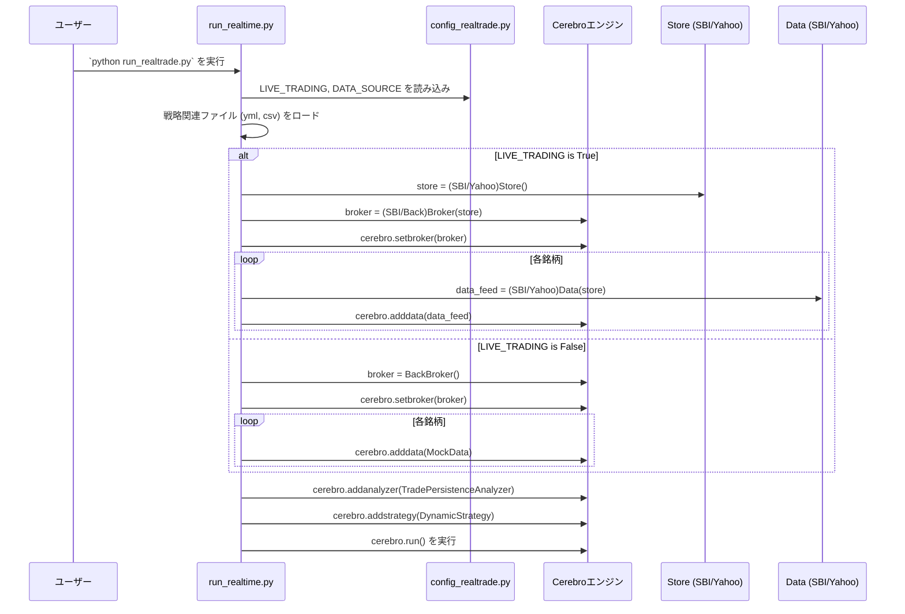
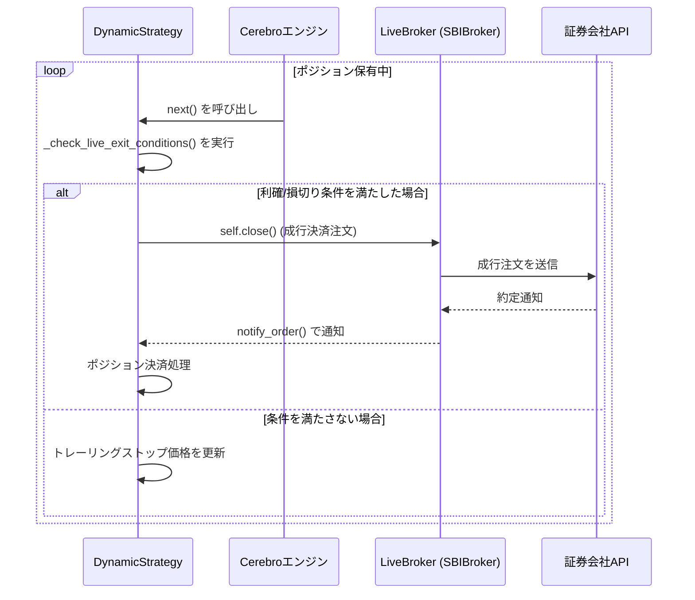
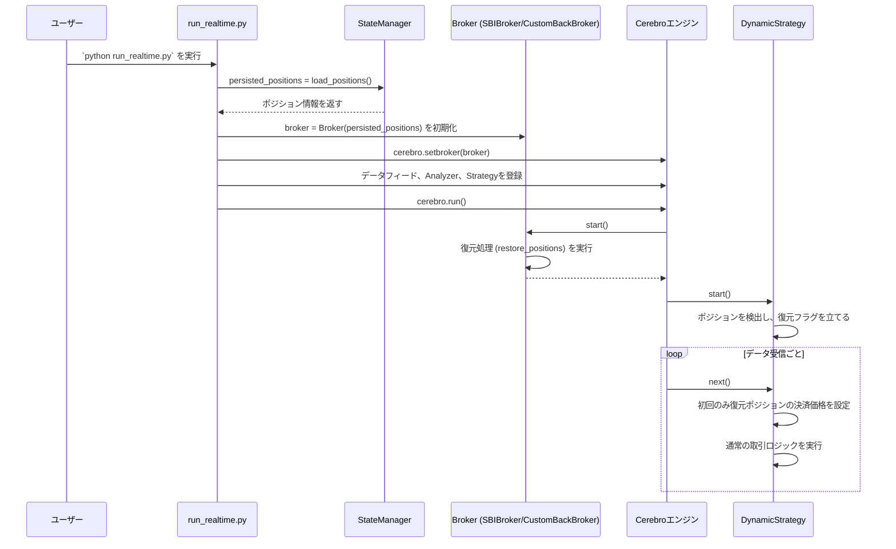
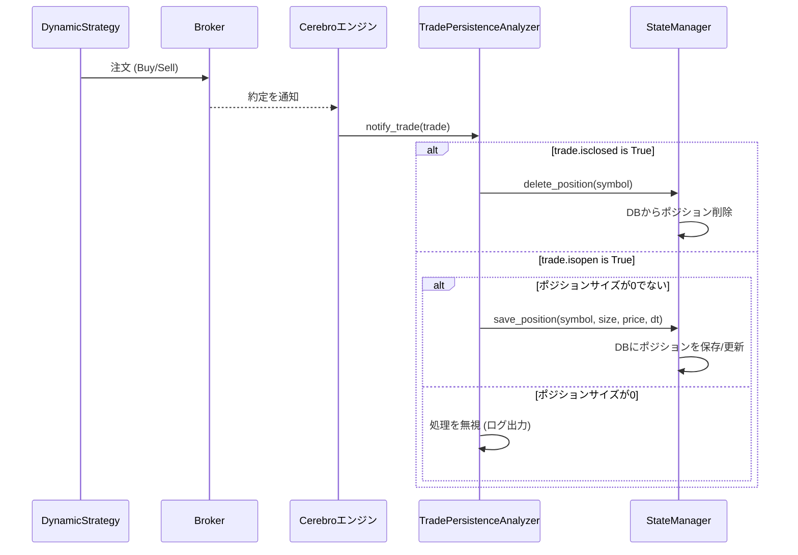

# **株自動トレードシステム 詳細設計書 v7.0 (リアルタイム機能)**

## **1. 改訂履歴**

| バージョン | 改訂日 | 改訂内容 | 作成者 |
| :--- | :--- | :--- | :--- |
| **7.0** | **2025/07/02** | **状態復元機能(実装計画3.4)の実装を反映。Brokerの責務、backtraderのライフサイクルを考慮したアーキテクチャ変更を記載。** | Gemini |
| 6.0 | 2025/07/02 | バックテスト時のデグレード分析結果を反映。`btrader_strategy.py` (v17.1) の実装上の課題を「6. 既知の課題」として明記。 | Gemini |
| 5.0 | 2025/07/01 | リアルタイムトレードにおけるクライアントサイド決済ロジック（利確・トレーリングストップ）の実装を反映。 | Gemini |
| 4.0 | 2025/06/30 | `config_realtrade.py`の設定に基づき、モード（SBI/Yahoo/Mock）を切り替える実装を反映。Store/Broker/Dataパターンの導入と、それに伴うコンポーネント構成の更新。 | Gemini |
| 3.0 | 2025/06/29 | 状態永続化の責務をBrokerからAnalyzer (`TradePersistenceAnalyzer`) に移譲するアーキテクチャ変更を反映。カスタムブローカーを廃止し、設計を大幅に簡素化。 | Gemini |
| 2.0 | 2025/06/28 | v11.0/v77.0の最新実装を反映。戦略合成ロジック、Broker仕様を正式化。 | Gemini |
| 1.1 | 2025/06/26 | 複数銘柄・複数戦略対応の設計を反映 | Gemini |
| 1.0 | 2025/06/26 | 初版作成 | Gemini |

## **2. システム概要**

本システムは、証券会社のAPIと連携して株式の自動売買を行うものである。「共通設定(strategy.yml)」と「エントリー戦略カタログ(strategies.yml)」を動的に合成し、「戦略割り当て表(all_recommend_*.csv)」に基づいて各銘柄に適用する戦略を決定する。

**v7.0では、システムの堅牢性を高めるため、状態復元機能が実装された。** システムは起動時にデータベースから前回終了時のポジション情報を読み込み、取引状態を引き継いで再開する。これにより、予期せぬ停止が発生した場合でも、手動介入なしで安全に取引を継続することが可能となる。

リアルタイムトレードのシミュレーション（ドライラン）では、ポジション復元機能を持つ**カスタムブローカー**が注文を処理し、**カスタムアナライザー (`TradePersistenceAnalyzer`)** が取引イベントを監視して、ポジションの状態をデータベースに永続化する。

### **動作モード**
v4.0では、システムの動作モードを柔軟に切り替える機構を導入した。
v4.0で導入されたマルチモードアーキテクチャを引き続き採用する。`config_realtrade.py`の設定により、以下の3つのモードで動作する。

1.  **SBI実取引モード (`LIVE_TRADING=True`, `DATA_SOURCE='SBI'`)**:
    SBI証券のAPIと直接連携し、実際の口座での発注およびデータ取得を行う。

2.  **Yahooデータ連携モード (`LIVE_TRADING=True`, `DATA_SOURCE='YAHOO'`)**:
    Yahoo Financeからリアルタイムの価格データを取得しつつ、発注処理はポジション復元機能を持つカスタムブローカー(`CustomBackBroker`)でシミュレーションする。

3.  **完全シミュレーションモード (`LIVE_TRADING=False`)**:
    外部接続を一切行わず、内蔵のモックデータを使用して全機能のシミュレーションを実行する。

このマルチモードアーキテクチャにより、開発から本番稼働まで、一貫したコードベースで安全かつ効率的に対応することを可能にする。

v4.0で導入されたマルチモードアーキテクチャ（SBI実取引/Yahooデータ連携/完全シミュレーション）に加え、**v5.0ではリアルタイムトレードにおける決済ロジックの堅牢性を大幅に向上させた。**

多くの証券会社APIがネイティブのトレーリングストップ注文をサポートしていないという現実的な制約に対応するため、本システムは`live_trading`フラグによって決済ロジックを切り替えるデュアルモード方式を採用する。

* **バックテスト時**: `backtrader`ネイティブの`StopTrail`注文を使用し、理論上最も正確なパフォーマンスを測定する。
* **リアルタイムトレード時**: `Strategy`クラスがクライアントサイドで価格を常時監視し、利確・損切り条件を満たした時点で証券会社APIが確実に実行できる**成行注文**を発行する。

これにより、バックテストの再現性を可能な限り維持しつつ、現実の取引環境で確実かつ安全にポジションを決済することを可能にする。

## **3. システムアーキテクチャ (v7.0)**

### **3.1. コンポーネント構成図**

```mermaid
graph TD
    subgraph "設定レイヤー"
        A["<b>config_realtrade.py</b><br>(動作モード, 初期資金)"]
        B["<b>strategy.yml</b><br>(共通基盤)"]
        C["<b>strategies.yml</b><br>(エントリー戦略カタログ)"]
        D["<b>all_recommend_*.csv</b><br>(戦略割り当て表)"]
    end

    subgraph "実行レイヤー"
        E[メインコントローラー<br><b>run_realtrade.py</b>]

        subgraph "Cerebroエンジン"
            F[Cerebro<br><b>backtrader</b>]
            G[DynamicStrategy]
            H[TradePersistenceAnalyzer]
        end
        
        subgraph "データソース / Broker実装"
            direction TB
            subgraph "SBIモード"
                I[SBIStore]
                J[SBIBroker]
                K[SBIData]
            end
            subgraph "Yahooモード"
                L[YahooStore]
                M[<b>CustomBackBroker</b><br>(状態復元機能付き)]
                N[YahooData]
            end
            subgraph "シミュレーションモード"
                O[MockDataFetcher]
                P[BackBroker]
            end
        end

        subgraph "永続化レイヤー"
            Q[StateManager<br><b>realtrade/state_manager.py</b>]
            R[(SQLiteデータベース)]
        end

        A & B & C & D -->|読み込み| E
        E -->|初期化 & 登録| F
        
        F -- 実行 --> G
        F -- イベント通知 --> H

        G -- 注文発行 --> J & M & P
        H -- DB操作 --> Q
        Q <--> R
        
        E -- モード選択 & データ注入 --> I & J & K
        E -- モード選択 & データ注入 --> L & M & N
        E -- モード選択 --> O & P

        I & L & O -->|データ供給| K & N & G

        Q -- ポジション情報 --> E
        E -- ポジション情報 --> J & M
    end
    
    style E fill:#cce5ff,stroke:#b8daff
    style M fill:#d4edda,stroke:#c3e6cb
```

### **3.2. 処理フロー**

#### **3.2.1. 処理フロー (起動時)**



#### **3.2.2. 処理フロー (リアルタイムトレード時の決済)**



#### **3.2.3. 処理フロー (起動・状態復元)**



#### **3.2.4. 処理フロー (DB永続化)**



## **4. モジュール詳細設計 (v7.0)**

### **4.1. メインコントローラー (run_realtrade.py)**
* **クラス**: `RealtimeTrader`
* **責務**:
    * (変更なし) システム全体の起動・停止シーケンスの管理。
    * **(更新)** `config_realtrade.py`から`INITIAL_CASH`を読み込む。
    * **(更新)** `StateManager`を介してDBからポジション情報を取得し、Brokerの初期化時に渡す。
    * (変更なし) `backtrader.Cerebro`エンジンをセットアップし、動作モードに応じて適切な`Store`, `Broker`, `Data`の各クラスをインスタンス化してCerebroに登録する。
    * (変更なし) `TradePersistenceAnalyzer`（状態永続化）をCerebroに追加する。
    * (変更なし) `DynamicStrategy`をCerebroに追加する際、`live_trading`フラグをパラメータとして渡す。

### **4.2. データソース / Brokerモジュール**
* **設計思想**:
    * **Store**: 外部APIとの通信（口座情報取得、発注、履歴データ取得など）を直接担当する。
    * **Broker**: `backtrader`の`BrokerBase`を継承し、`Store`を介して実際の取引を模倣・実行する。
    * **Data**: `backtrader`の`feeds`クラスを継承し、`Store`から取得した価格データをCerebroに供給する。


* **`realtrade/brokers/custom_back_broker.py` (新規)**
    * **クラス**: `CustomBackBroker`
    * **責務**: `backtrader`標準の`BackBroker`を継承し、状態復元機能を追加する。Yahooデータ連携モードで使用される。
    * **`__init__(self, persisted_positions, **kwargs)`**: 初期資金に加え、DBから読み込んだポジション情報を受け取る。
    * **`start(self)`**: `backtrader`のライフサイクルに従い、自身の初期化処理完了後に`restore_positions`を呼び出す。
    * **`restore_positions(self, db_positions, datasbyname)`**: ポジション情報を`self.positions`に設定し、現金残高を調整する。

* **`realtrade/live/sbi_broker.py` (更新)**
    * **クラス**: `SBIBroker`
    * **責務**: `SBIStore`を利用した取引執行と、状態復元機能を提供する。
    * **`__init__(self, store, persisted_positions)`**: `store`に加え、DBから読み込んだポジション情報を受け取る。
    * **`start(self)`**: `backtrader`のライフサイクルに従い、自身の初期化処理完了後に`restore_positions`を呼び出す。
    * **`restore_positions(self, db_positions, datasbyname)`**: ポジション情報を`self.positions`に設定し、現金残高を調整する。

### **4.3. 戦略実行クラス (btrader_strategy.py)**
* **クラス**: `DynamicStrategy`
* **責務**:
    * **(更新)** `__init__`で`restored_position_setup_needed`フラグを初期化する。
    * **(更新)** `start()`メソッドで、`self.getposition()`によりブローカーから復元されたポジションを検知する。ポジションが存在する場合、`restored_position_setup_needed`フラグを`True`に設定する。
    * **(更新)** `next()`メソッドの先頭で`restored_position_setup_needed`フラグをチェックする。`True`の場合、復元されたポジションに対して`_setup_live_exit_prices`を呼び出して決済価格を設定し、フラグを`False`に戻す。このアプローチにより、インジケーターが計算済みであることを保証する。
    * (変更なし) `_check_live_exit_conditions`でクライアントサイドの決済ロジックを実行する。

### **4.4. 状態永続化アナライザー (realtrade/analyzer.py)**
* **クラス**: `TradePersistenceAnalyzer`
* **責務**:
    * **(更新)** `notify_trade`メソッドのロジックを堅牢化。
        * `trade.isclosed`が`True`の場合、DBから該当ポジションを削除する。
        * `trade.isopen`が`True`の場合、`pos.size`が`0`でないことを確認してからDBに保存/更新する。これにより、決済時に発生するサイズ0の誤ったオープン通知を無視する。


### **4.5. 状態管理モジュール (realtime/state_manager.py)**
* **責務**: SQLiteデータベースとの接続、テーブルの作成、ポジション情報のCRUD（作成・読み取り・更新・削除）操作を提供する。（変更なし）


## **5. アーキテクチャ設計思想**

### **5.1. アーキテクチャ設計思想（v3.0での変更点）**

バージョン2.0までのカスタムブローカー (`BrokerBridge`) を利用した設計から、`backtrader`の標準ブローカーとカスタムアナライザーを組み合わせる設計へと変更した。

* **変更理由**:
    1.  **関心の分離**: 注文執行のシミュレーション（ブローカーの役割）と、その結果の永続化（アナライザーの役割）を明確に分離できる。
    2.  **`backtrader`への準拠**: `Analyzer`は、`backtrader`が公式にサポートするイベント監視・分析のための仕組みであり、フレームワークの思想に沿った自然な実装となる。
    3.  **コードの簡素化**: `get_notification`のような通知キューの管理や、注文状態の複雑なハンドリングを`backtrader`の標準ブローカーに任せることができるため、自作コードが大幅に削減され、堅牢性が向上する。

この変更により、将来実際の証券会社APIに接続する際も、この`TradePersistenceAnalyzer`を再利用または参考にすることで、スムーズな移行が期待できる。
### **5.2. アーキテクチャ設計思想（v4.0での変更点）**
* **モード分離による安全性と開発効率の向上**:
    * `config_realtrade.py`のフラグ一つで、本番環境・データ連携シミュレーション・完全シミュレーションを切り替えられるようにした。
    * これにより、実際の資金を動かすことなく、APIから取得した本物のデータでロジックを検証したり、外部接続なしでUIや基本機能の開発を進めたりすることが可能になる。

* **`Store / Broker / Data` パターンの採用**:
    * 証券会社ごとの実装を`realtrade/live`配下にカプセル化した。
    * API通信(Store)、取引執行(Broker)、データ供給(Data)という責務を分離することで、将来的に他の証券会社（例: 楽天証券）に対応する際、`realtrade/live/rakuten_*.py`を追加するだけで容易に拡張できる。

* **リアルタイム処理の堅牢化**:
    * `YahooData`フィードでは、バックグラウンドで価格データを取得するために独立した**デーモンスレッド**を使用する。これにより、メインプログラムが`Ctrl+C`などで終了した際に、データ取得スレッドも確実に追従して終了し、リソースリークを防ぐ。
    * `yfinance`から返されるデータ形式の揺らぎ（MultiIndexや重複カラム）に対応するため、データ供給前に整形・クリーニング処理を行い、システムの安定性を高めている。

### **5.3. v5.0での変更点 (決済ロジック)**
* **デュアルモード決済ロジックの採用**:
    * 多くの証券会社APIが、`StopTrail`（トレーリングストップ）のような高度な注文タイプをサポートしていない。この制約を吸収し、システムの汎用性と確実性を高めるため、バックテストとリアルタイムトレードで決済ロジックを分離した。
    * **バックテスト**では、`backtrader`のネイティブ注文を利用することで、スリッページや遅延のない「理想環境」での戦略パフォーマンスを正確に測定する。
    * **リアルタイムトレード**では、`Strategy`が自ら価格を監視し、決済条件を判定する「クライアントサイド・ロジック」を採用。これにより、APIがサポートする最も基本的な「成行注文」で決済を実行でき、ブローカーの実装に依存しない堅牢なシステムを実現する。

* **差異の許容とリスク管理**:
    * このアプローチでは、バックテストとリアルタイムトレードの間に、スリッページやデータ受信の遅延によるパフォーマンスの差異が必然的に生じる。
    * これはシステムの欠陥ではなく、現実の取引環境を反映するための意図的な設計上のトレードオフである。
    * リアルタイムトレードでは、「理論価格から多少ズレてでも、確実に決済を実行すること」を最優先とし、大きな損失リスクを回避する設計となっている。

## **5.4. v6.0での変更点 (v6.0)**

* **バックテストにおけるデグレードの発生 (v17.1)**:
    * **現象**: `btrader_strategy.py` (v17.1) を用いてバックテストを実行すると、各銘柄で最初の取引が決済されずにテスト期間の最後まで持ち越され、取引回数が大幅に減少するデグレードが発生し、対策済み。
    * **原因**: `next()`メソッドの先頭に実装されたガード条件 `if self.exit_orders:` が原因である。バックテストでは、エントリー後にネイティブの決済注文（`StopTrail`等）が発行され、`self.exit_orders`リストに格納される。このリストはポジションが決済されるまで空にならないため、`next()`メソッドが常に早期リターンしてしまう。これにより、`backtrader`エンジンによるネイティブ決済注文の判定処理がスキップされ、決済が行われない。
    * **対策**: `next()`メソッドのガード条件を、リアルタイムトレード時（クライアントサイドの成行注文を待機する場合）に限定して適用するよう修正した。具体的には、`if self.live_trading and self.exit_orders:` のように、ライブトレードモードでのみ決済注文の存在をチェックするロジックに変更した。


## **6. 実装上の考慮点**

### **6.1. `backtrader`のライフサイクルと状態復元**
* **課題**: `backtrader`の実行エンジン(`cerebro.run()`)は、内部的に厳密なライフサイクル（初期化→`start`→`prenext`→`next`...）に従って各コンポーネントを呼び出す。当初の実装では、このライフサイクル外でポジションを復元しようとしたため、ブローカーの`start`メソッドによって復元した状態がリセットされてしまう問題が発生した。
* **解決策**: ポジション復元の責務を全面的にBrokerクラスに移譲した。`run_realtime.py`はDBから読み込んだポジション情報をBrokerのコンストラクタに渡すだけにとどめる。Brokerは自身の`start`メソッド内で、`backtrader`の標準初期化処理を終えた直後にポジションを復元することで、状態がリセットされることなく、後続の`Strategy.start`メソッドで正しく認識されるようになった。

### **6.2. インジケーターの計算タイミング**
* **課題**: 戦略の`start()`メソッドは、インジケーターの最小期間が満たされる前に呼び出される。そのため、`start()`内でATRのようなインジケーターの値にアクセスしようとすると、データが存在せず`IndexError`が発生した。
* **解決策**: 復元されたポジションに対する決済価格の設定処理を、`start()`から`next()`メソッドの初回実行時に移動した。`start()`ではポジションの存在を検知してフラグを立てるだけにとどめ、インジケーターの計算が完了していることが保証される`next()`の冒頭で実際のセットアップ処理を行うことで、エラーを回避した。

### **6.3. `notify_trade`の通知仕様**
* **課題**: `backtrader`では、ポジションが決済された際に`trade.isclosed`が`True`になるだけでなく、サイズが`0`の`trade.isopen`も通知される場合がある。この仕様を考慮せずに実装すると、決済と同時にサイズ`0`のポジションがDBに保存されてしまい、データ不整合を引き起こす。
* **解決策**: `TradePersistenceAnalyzer`の`notify_trade`メソッドを修正し、`trade.isopen`が通知された場合でも、ブローカーのポジションサイズが`0`でないことを確認してからDB保存処理を行うようにした。これにより、意図しないDB更新を防ぎ、システムの堅牢性を高めた。
