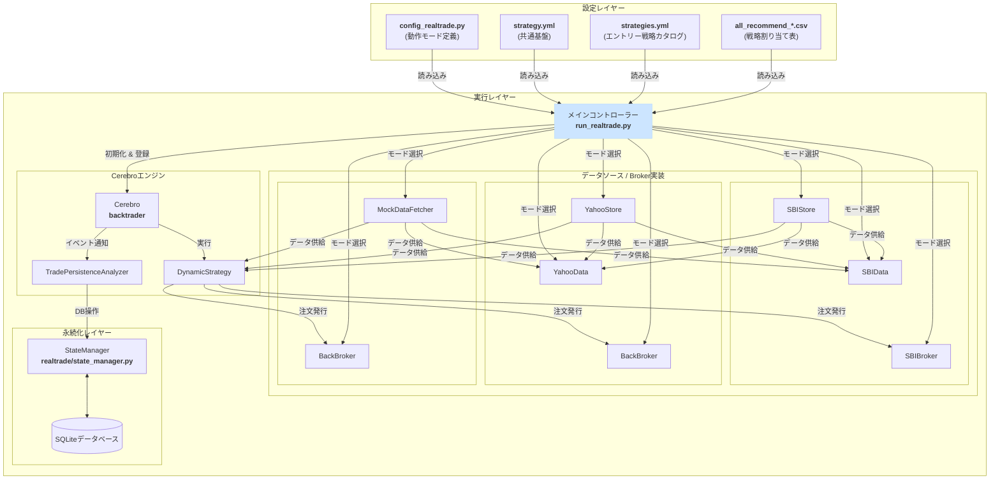
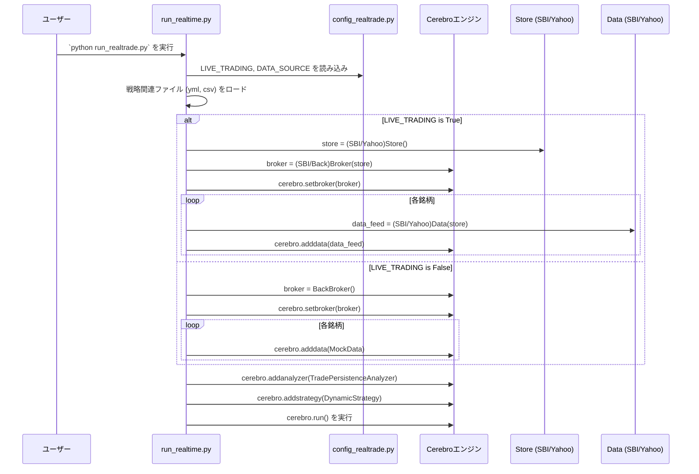

# **株自動トレードシステム 詳細設計書 v4.0 (リアルタイム機能)**

## **1. 改訂履歴**

| バージョン | 改訂日 | 改訂内容 | 作成者 |
| :--- | :--- | :--- | :--- |
| **4.0** | **2025/06/30** | **`config_realtrade.py`の設定に基づき、モード（SBI/Yahoo/Mock）を切り替える実装を反映。Store/Broker/Dataパターンの導入と、それに伴うコンポーネント構成の更新。** | Gemini |
| 3.0 | 2025/06/29 | 状態永続化の責務をBrokerからAnalyzer (`TradePersistenceAnalyzer`) に移譲するアーキテクチャ変更を反映。カスタムブローカーを廃止し、設計を大幅に簡素化。 | Gemini |
| 2.0 | 2025/06/28 | v11.0/v77.0の最新実装を反映。戦略合成ロジック、Broker仕様を正式化。 | Gemini |
| 1.1 | 2025/06/26 | 複数銘柄・複数戦略対応の設計を反映 | Gemini |
| 1.0 | 2025/06/26 | 初版作成 | Gemini |

## **2. システム概要**

本システムは、証券会社のAPIと連携して株式の自動売買を行うものである。「共通設定(strategy.yml)」と「エントリー戦略カタログ(strategies.yml)」を動的に合成し、「戦略割り当て表(all_recommend_*.csv)」に基づいて各銘柄に適用する戦略を決定する。

**v4.0では、システムの動作モードを柔軟に切り替える機構を導入した。`config_realtrade.py`の設定により、以下の3つのモードで動作する。**

1.  **SBI実取引モード (`LIVE_TRADING=True`, `DATA_SOURCE='SBI'`)**:
    SBI証券のAPIと直接連携し、実際の口座での発注およびデータ取得を行う。

2.  **Yahooデータ連携モード (`LIVE_TRADING=True`, `DATA_SOURCE='YAHOO'`)**:
    Yahoo Financeからリアルタイムの価格データを取得しつつ、発注処理は`backtrader`の内部ブローカーでシミュレーションする。売買ロジックの安全な検証に用いる。

3.  **完全シミュレーションモード (`LIVE_TRADING=False`)**:
    外部接続を一切行わず、内蔵のモックデータを使用して全機能のシミュレーションを実行する。

このマルチモードアーキテクチャにより、開発から本番稼働まで、一貫したコードベースで安全かつ効率的に対応することを可能にする。

## **3. システムアーキテクチャ (v4.0)**

### **3.1. コンポーネント構成図**

### **3.2. 処理フロー (起動時)**

## **4. モジュール詳細設計 (v4.0)**

### **4.1. メインコントローラー (run_realtrade.py)**
* **クラス**: `RealtimeTrader`
* **責務**:
    * システム全体の起動・停止シーケンスの管理。
    * `config_realtrade.py`を読み込み、動作モードを決定する。
    * `backtrader.Cerebro`エンジンをセットアップし、**動作モードに応じて適切な`Store`, `Broker`, `Data`の各クラスをインスタンス化してCerebroに登録する。**
    * `TradePersistenceAnalyzer`（状態永続化）と`DynamicStrategy`（戦略）をCerebroに追加する。

### **4.2. データソース連携モジュール (`realtrade/live/`)**
* **設計思想**:
    * **Store**: 外部APIとの通信（口座情報取得、発注、履歴データ取得など）を直接担当する。
    * **Broker**: `backtrader`の`BrokerBase`を継承し、`Store`を介して実際の取引を模倣・実行する。
    * **Data**: `backtrader`の`feeds`クラスを継承し、`Store`から取得した価格データをCerebroに供給する。
* **`realtrade/live/sbi_*.py`**:
    * **`SBIStore`**: SBI証券APIとの通信ロジックを実装。
    * **`SBIBroker`**: `SBIStore`を利用して発注・キャンセルなどを行うカスタムブローカー。
    * **`SBIData`**: `SBIStore`から取得した価格データをリアルタイムに供給するデータフィード。
* **`realtrade/live/yahoo_*.py`**:
    * **`YahooStore`**: `yfinance`ライブラリを利用して、Yahoo Financeから履歴データを取得するロジックを実装。（発注機能は持たない）
    * **`YahooData`**: `YahooStore`から取得した価格データをリアルタイムに供給するデータフィード。
    * **Broker**: `DATA_SOURCE='YAHOO'`の場合、`run_realtime.py`は`backtrader`標準の`BackBroker`を使用する。

### **4.3. 戦略実行クラス (btrader_strategy.py)**
* **クラス**: `DynamicStrategy`
* **責務**: (変更なし)
    * `run_realtime.py`から渡された戦略パラメータに基づき、インジケーター計算と売買条件評価を行う。
    * `self.buy()` / `self.sell()` を通じて、Cerebroに登録されたブローカー（`SBIBroker`または`BackBroker`）に対して注文を発行する。

### **4.4. 状態永続化アナライザー (realtrade/analyzer.py)**
* **クラス**: `TradePersistenceAnalyzer`
* **責務**: (変更なし)
    * `backtrader`の取引イベント(`notify_trade`)を監視する。
    * 取引の開始・終了を検知し、`StateManager`を通じてポジション状態をデータベースに永続化する。

### **4.5. 状態管理モジュール (realtime/state_manager.py)**
* **責務**: SQLiteデータベースとの接続、テーブルの作成、ポジション情報のCRUD（作成・読み取り・更新・削除）操作を提供する。（変更なし）

## **5. アーキテクチャ設計思想（v3.0での変更点）**

バージョン2.0までのカスタムブローカー (`BrokerBridge`) を利用した設計から、`backtrader`の標準ブローカーとカスタムアナライザーを組み合わせる設計へと変更した。

* **変更理由**:
    1.  **関心の分離**: 注文執行のシミュレーション（ブローカーの役割）と、その結果の永続化（アナライザーの役割）を明確に分離できる。
    2.  **`backtrader`への準拠**: `Analyzer`は、`backtrader`が公式にサポートするイベント監視・分析のための仕組みであり、フレームワークの思想に沿った自然な実装となる。
    3.  **コードの簡素化**: `get_notification`のような通知キューの管理や、注文状態の複雑なハンドリングを`backtrader`の標準ブローカーに任せることができるため、自作コードが大幅に削減され、堅牢性が向上する。

この変更により、将来実際の証券会社APIに接続する際も、この`TradePersistenceAnalyzer`を再利用または参考にすることで、スムーズな移行が期待できる。

## **5. アーキテクチャ設計思想（v4.0での変更点）**
* **モード分離による安全性と開発効率の向上**:
    * `config_realtrade.py`のフラグ一つで、本番環境・データ連携シミュレーション・完全シミュレーションを切り替えられるようにした。
    * これにより、実際の資金を動かすことなく、APIから取得した本物のデータでロジックを検証したり、外部接続なしでUIや基本機能の開発を進めたりすることが可能になる。

* **`Store / Broker / Data` パターンの採用**:
    * 証券会社ごとの実装を`realtrade/live`配下にカプセル化した。
    * API通信(Store)、取引執行(Broker)、データ供給(Data)という責務を分離することで、将来的に他の証券会社（例: 楽天証券）に対応する際、`realtrade/live/rakuten_*.py`を追加するだけで容易に拡張できる。

* **リアルタイム処理の堅牢化**:
    * `YahooData`フィードでは、バックグラウンドで価格データを取得するために独立した**デーモンスレッド**を使用する。これにより、メインプログラムが`Ctrl+C`などで終了した際に、データ取得スレッドも確実に追従して終了し、リソースリークを防ぐ。
    * `yfinance`から返されるデータ形式の揺らぎ（MultiIndexや重複カラム）に対応するため、データ供給前に整形・クリーニング処理を行い、システムの安定性を高めている。
