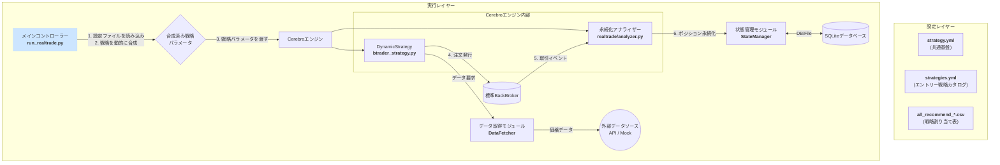
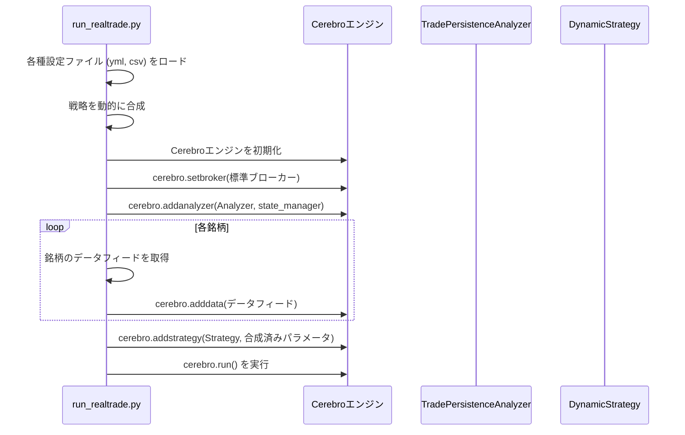

# **株自動トレードシステム 詳細設計書 v3.0 (リアルタイム機能)**

## **1. 改訂履歴**

| バージョン | 改訂日 | 改訂内容 | 作成者 |
| :--- | :--- | :--- | :--- |
| **3.0** | **2025/06/29** | **状態永続化の責務をBrokerからAnalyzer (`TradePersistenceAnalyzer`) に移譲するアーキテクチャ変更を反映。カスタムブローカーを廃止し、設計を大幅に簡素化。** | Gemini |
| 2.0 | 2025/06/28 | v11.0/v77.0の最新実装を反映。戦略合成ロジック、Broker仕様を正式化。 | Gemini |
| 1.1 | 2025/06/26 | 複数銘柄・複数戦略対応の設計を反映 | Gemini |
| 1.0 | 2025/06/26 | 初版作成 | Gemini |

## **2. システム概要**

本システムは、証券会社のAPIと連携して株式の自動売買を行うものである。「共通設定(strategy.yml)」と「エントリー戦略カタログ(strategies.yml)」を動的に合成し、「戦略割り当て表(all_recommend_*.csv)」に基づいて各銘柄に適用する戦略を決定する。この柔軟な戦略管理機構により、日々の市場状況に応じた迅速な設定変更を可能にする。

リアルタイムトレードのシミュレーション（ドライラン）では、**`backtrader`標準のブローカー**が注文を処理し、**カスタムAnalyzer (`TradePersistenceAnalyzer`)** が取引イベントを監視して、ポジションの状態をデータベースに永続化する。これにより、実際のAPI連携を実装する前に、ロジックの正当性を安全かつ効率的に検証できる。

## **3. システムアーキテクチャ**

### **3.1. コンポーネント構成図 (v3.0)**

### **3.2. 処理フロー (起動時)**

## **4. モジュール詳細設計 (v3.0)**

### **4.1. メインコントローラー (run_realtrade.py)**

* **クラス**: `RealtimeTrader`
* **責務**:
    * システム全体の起動・停止シーケンスの管理。
    * 設定ファイルの読み込みと戦略の動的合成。
    * `backtrader.Cerebro`エンジンのセットアップと実行。
    * **標準ブローカー (`bt.brokers.BackBroker`) をセットアップする。**
    * **`TradePersistenceAnalyzer` を `StateManager` と共にCerebroエンジンに追加する。**
* **主要メソッド**:
    * `_setup_cerebro()`: `setbroker`で標準ブローカーを設定し、`addanalyzer`で永続化用アナライザーを追加する。

### **4.2. 戦略実行クラス (btrader_strategy.py)**

* **クラス**: `DynamicStrategy`
* **責務**:
    * `run_realtrade.py`から渡された、合成済みの単一の戦略パラメータ (`self.p.strategy_params`) に基づいて動作する。
    * インジケーターの計算、エントリーおよびエグジット条件の評価を行う。
    * **`self.buy()` / `self.sell()` を通じて、Cerebroに登録された標準ブローカーに対して注文を発行する。**
* **主要メソッド**:
    * `__init__()`:
        * 渡された`strategy_params`を自身のパラメータとして設定する。
        * `exit_conditions`と`stop_loss`の存在を必須項目として検証する。
    * `notify_order()`, `notify_trade()`: 注文や取引の状態変化をログに記録する。（状態永続化の責務は持たない）

### **4.3. 状態永続化アナライザー (realtrade/analyzer.py)**

* **目的**: **`backtrader`の取引イベントを監視し、ポジションの状態をデータベースに永続化することに特化する。** これにより、注文執行ロジックと状態保存ロジックを完全に分離する。
* **クラス**: `TradePersistenceAnalyzer`
* **基底クラス**: `backtrader.Analyzer`
* **責務**:
    * `Cerebro`から`StateManager`のインスタンスを受け取る。
    * 取引イベント（`notify_trade`）をフックする。
    * 取引がオープンされたら、`StateManager.save_position()`を呼び出す。
    * 取引がクローズされたら、`StateManager.delete_position()`を呼び出す。
* **主要メソッド**:
    * `__init__()`: `cerebro.addanalyzer`から渡された`state_manager`をインスタンス変数として保持する。
    * `notify_trade(trade)`:
        * `trade.isopen` または `trade.isclosed` を判定する。
        * 対応する`StateManager`のメソッドを呼び出して、データベース操作を実行する。

### **4.4. 状態管理モジュール (realtime/state_manager.py)**

* **責務**: SQLiteデータベースとの接続、テーブルの作成、ポジション情報のCRUD（作成・読み取り・更新・削除）操作を提供する。（変更なし）

## **5. アーキテクチャ設計思想（v3.0での変更点）**

バージョン2.0までのカスタムブローカー (`BrokerBridge`) を利用した設計から、`backtrader`の標準ブローカーとカスタムアナライザーを組み合わせる設計へと変更した。

* **変更理由**:
    1.  **関心の分離**: 注文執行のシミュレーション（ブローカーの役割）と、その結果の永続化（アナライザーの役割）を明確に分離できる。
    2.  **`backtrader`への準拠**: `Analyzer`は、`backtrader`が公式にサポートするイベント監視・分析のための仕組みであり、フレームワークの思想に沿った自然な実装となる。
    3.  **コードの簡素化**: `get_notification`のような通知キューの管理や、注文状態の複雑なハンドリングを`backtrader`の標準ブローカーに任せることができるため、自作コードが大幅に削減され、堅牢性が向上する。

この変更により、将来実際の証券会社APIに接続する際も、この`TradePersistenceAnalyzer`を再利用または参考にすることで、スムーズな移行が期待できる。
