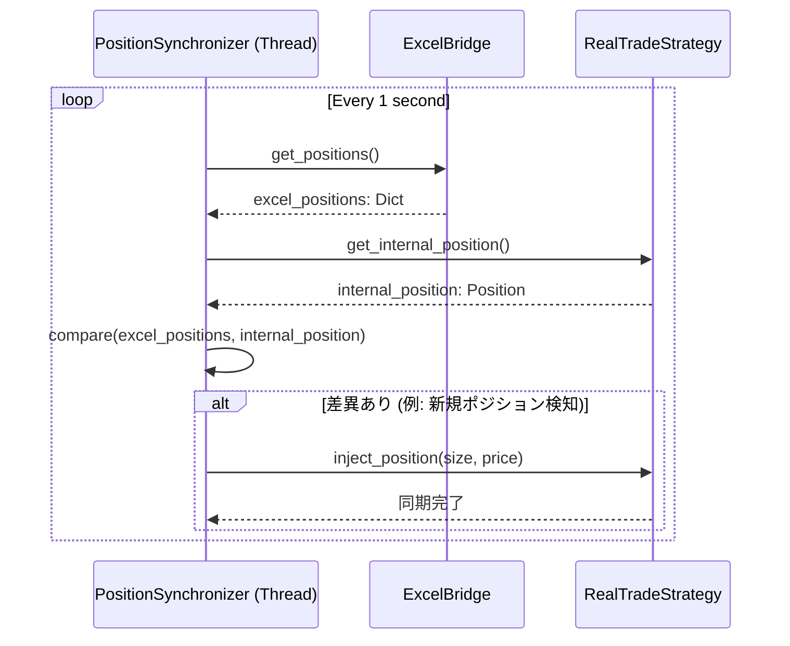

はい、承知いたしました。これまでの議論と合意した仕様に基づき、実装担当者が参照することを想定した詳細設計書をMarkdown形式で作成します。

-----

# リアルタイムトレード ポジション同期機能 詳細設計書

## 1\. 概要

### 1.1. 設計目的

本ドキュメントは、「リアルタイムトレード ポジション同期機能 仕様書」に基づき、具体的なクラスやメソッドの変更、データフロー、処理ロジックを定義することを目的とする。本設計は、Excelファイル(`trading_hub.xlsm`)を唯一の正とし、システムの内部状態を常に実際の保有状況と一致させるための実装詳細を定める。

### 1.2. 対象範囲

本設計の対象は`src/realtrade/`パッケージ配下のモジュールに限定される。`src/backtest/`パッケージは変更対象外とする。

-----

## 2\. アーキテクチャ

### 2.1. 全体構成

本機能は、既存の`ExcelBridge`の機能拡張と、`run_realtrade.py`に新設する`PositionSynchronizer`（ポジション同期スレッド）、そして`RealTradeStrategy`のロジック変更によって実現される。`PositionSynchronizer`が全体を監視し、`ExcelBridge`から実態を取得、`RealTradeStrategy`に状態の補正を指示する構成を取る。

### 2.2. シーケンス図 (同期処理)

リアルタイムフェーズにおけるポジション同期処理のシーケンスは以下の通り。

-----

## 3\. データモデル

### 3.1. 実ポジションデータ

`ExcelBridge`が`get_positions()`メソッドで返却し、システム全体で利用するデータ形式。

  * **型**: `Dict[str, Dict[str, float]]`
  * **キー**: 銘柄コード (文字列)
  * **値**: ポジション情報 (辞書)
      * `size` (float): 保有数量。**買建は正**、**売建は負**の値。
      * `price` (float): 平均取得価格（建値）。
  * **例**: `{'1332': {'size': 100.0, 'price': 2500.5}, '1605': {'size': -200.0, 'price': 3100.0}}`

-----

## 4\. コンポーネント別 詳細設計

### 4.1. `src/realtrade/bridge/excel_bridge.py`

#### **`ExcelBridge` クラス**

##### `get_positions()` メソッド (新規追加)

  * **責務**: `position`シートを読み取り、現在の全実ポジション情報を標準形式で返却する。
  * **引数**: なし
  * **返り値**: `Dict[str, Dict[str, float]]` (前述のデータモデル形式)
  * **処理ロジック**:
    1.  `xlwings`を使用し`trading_hub.xlsm`の`position`シートに接続する。
    2.  3行目からA列の値を順に読み取り、セルの値が`--------`となるまでをデータ範囲とする。
    3.  各行について、以下の列からデータを抽出する。
          * A列: `symbol` (銘柄コード)
          * G列: `side` (売買区分)
          * H列: `quantity` (建玉数量)
          * J列: `price` (建値)
    4.  `side`が`'買建'`なら`size = quantity`、`'売建'`なら`size = -quantity`として符号を決定する。
    5.  抽出したデータを`{symbol: {'size': size, 'price': price}}`の形式で辞書に格納する。
    6.  全行の処理完了後、構築した辞書を返却する。
    7.  ファイルI/Oエラーやデータ型の変換エラーが発生した場合は、ログにエラーを記録し、空の辞書`{}`を返す。

-----

### 4.2. `src/realtrade/run_realtrade.py`

#### **`RealtimeTrader` クラス**

`StateManager`関連の初期化コードを削除する。

#### **`PositionSynchronizer` クラス (新規追加)**

`threading.Thread`を継承した内部クラスまたは別クラスとして定義する。

  * **責務**: `backtrader`の内部ポジションとExcelの実ポジションを1秒間隔で比較し、乖離があれば`RealTradeStrategy`に同期を指示する。
  * **`__init__(self, bridge, strategies, stop_event)`**:
      * `bridge`: `ExcelBridge`のインスタンス
      * `strategies`: `{'銘柄コード': RealTradeStrategyインスタンス}` の形式の辞書
      * `stop_event`: スレッドを安全に停止させるための`threading.Event`
  * **`run(self)`**:
    1.  `while not self.stop_event.is_set():`のループを開始する。
    2.  `excel_positions = self.bridge.get_positions()`で実ポジションを取得する。
    3.  内部ポジション`internal_positions`を`{}`で初期化する。
    4.  `for symbol, strategy in self.strategies.items():`でループし、`strategy.live`が`True`かつ`strategy.position`が存在すれば、`internal_positions`に`{symbol: {'size': strategy.position.size, 'price': strategy.position.price}}`を追加する。
    5.  `excel_positions`と`internal_positions`を比較し、以下の3パターンの差異を検出する。
          * **新規検知**: `excel_positions`にのみ存在する銘柄。
          * **決済検知**: `internal_positions`にのみ存在する銘柄。
          * **数量変更検知**: 両方に存在するが`size`が異なる銘柄。
    6.  検出した差異に基づき、対応する`strategy`インスタンスのメソッドを呼び出す。
          * **新規/数量変更**: `strategy.inject_position(size, price)`
          * **決済検知**: `strategy.force_close_position()`
    7.  `time.sleep(1)`で1秒待機する。

-----

### 4.3. `src/realtrade/strategy.py`

#### **`RealTradeStrategy` クラス**

  * **`__init__(self)`**: `self.live = False`プロパティを追加する。
  * **`start(self)`**: (オーバーライド)
    1.  `self.live = True`を設定し、リアルタイムフェーズへの移行をマークする。
    2.  ログに「リアルタイムフェーズに移行」を記録する。
    3.  過去データ供給フェーズで構築された可能性のあるシミュレーションポジションを`if self.position: self.close()`でクリアする。
  * **`next(self)`**:
    1.  メソッド冒頭で`if not self.live: return`とし、リアルタイムフェーズ以外では取引ロジックを実行しないようにする。
    2.  エントリーシグナル発生時、`if not self.position:`の条件を追加し、内部（＝Excel）にポジションが存在しない場合のみ発注処理に進むように変更する。
  * **`inject_position(self, size, price)`**: (新規追加)
    1.  ログに「外部からポジションを注入」を記録する。
    2.  `self.position.size = size`、`self.position.price = price`として、`backtrader`の内部状態を直接更新する。
    3.  `self.exit_signal_generator.calculate_and_set_exit_prices(entry_price=price, is_long=(size > 0))`を呼び出し、新しい建値に基づいてTP/SLを再計算させる。
  * **`force_close_position(self)`**: (新規追加)
    1.  ログに「外部からポジションを決済」を記録する。
    2.  `self.close()`を呼び出し、内部ポジションを決済する。
    3.  決済シグナル生成器の状態を`self.exit_signal_generator.tp_price = 0.0`, `self.exit_signal_generator.sl_price = 0.0`のようにリセットする。