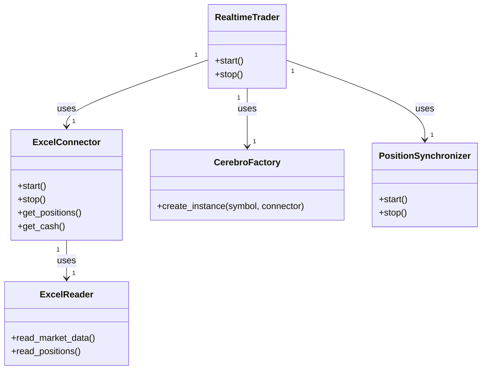
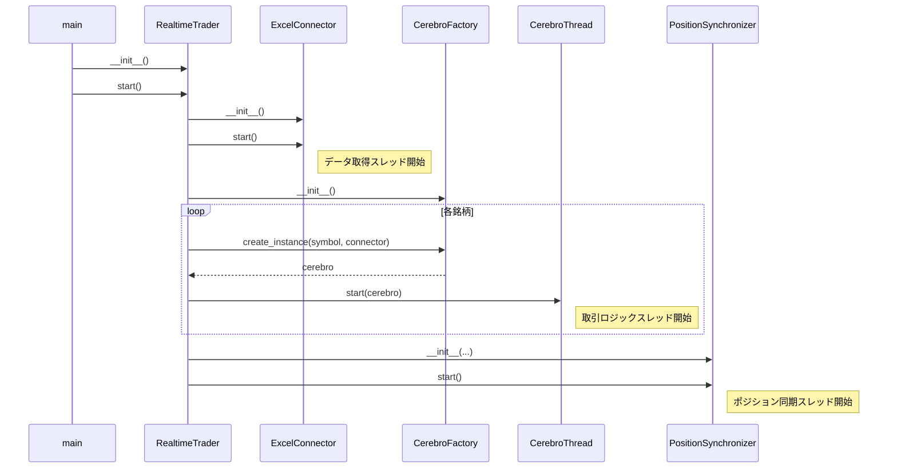

はい、承知いたしました。
先の基本仕様書に基づき、各クラスのプロパティやメソッド、処理フローを具体的に定義した**詳細設計書**を作成します。

-----

## リアルタイムトレード機能 リファクタリング詳細設計書

**日付**: 2025年9月26日
**バージョン**: 1.1

### 1\. 緒言

本ドキュメントは、「リアルタイムトレード機能 リファクタリング基本仕様書 v1.0」に基づき、各クラスの内部構造、プロパティ、メソッドの具体的な仕様、およびクラス間の連携方法について詳細に定義する。

-----

### 2\. クラス図

リファクタリング後の主要クラス間の関係を以下に示す。

-----

### 3\. 各クラスの詳細設計

#### 3.1. `excel_reader.py`

  * **ファイルパス**: `src/realtrade/bridge/excel_reader.py`
  * **クラス概要**: Excelシートのレイアウト知識を持ち、データ読み取りと解析に特化したステートレスなヘルパークラス。
  * **クラス名**: `ExcelReader`
  * **プロパティ**:
      * `data_sheet` (`xlwings.Sheet`): 'リアルタイムデータ'シートのオブジェクト。
      * `position_sheet` (`xlwings.Sheet`): 'position'シートのオブジェクト。
  * **メソッド仕様**:
      * **`__init__(self, sheets: xw.Sheets)`**
          * **概要**: `xlwings`のシートコレクションから必要なシートを抽出し、プロパティに保持する。
          * **引数**: `sheets` (`xlwings.Sheets`): ワークブックの全シート。
      * **`read_market_data(self)`**
          * **概要**: 市場データと現金残高を読み取り、整形された辞書を返す。
          * **返り値**: `dict`: `{<symbol_str>: {'close': float, ...}, 'account': {'cash': float}}` 形式のデータ。
          * **主要な処理ロジック**:
            1.  `self.data_sheet.range('A2:F10').value` で市場データを一括読み取り。
            2.  `self.data_sheet.range('B11').value` で現金残高を読み取り。
            3.  読み取ったデータをループ処理し、None値のチェックや型変換を行いながら、指定の辞書構造を構築する。
      * **`read_positions(self)`**
          * **概要**: 建玉情報を読み取り、整形された辞書を返す。
          * **返り値**: `dict`: `{<symbol_str>: {'size': float, 'price': float}}` 形式のデータ。
          * **主要な処理ロジック**:
            1.  `self.position_sheet.range('A3:J203').value` で建玉情報を一括読み取り。
            2.  各行を評価し、`'--------'` または `None` の場合は処理を中断する。
            3.  `'買建'`/`'売建'` の文字列を `size` (正/負のfloat) に変換する。
            4.  指定の辞書構造を構築する。

-----

#### 3.2. `excel_connector.py`

  * **ファイルパス**: `src/realtrade/bridge/excel_connector.py`
  * **クラス概要**: Excelとの接続、データ取得スレッドの管理、最新データの保持を行うサービス。
  * **クラス名**: `ExcelConnector`
  * **プロパティ**:
      * `latest_data` (`dict`): 最新の市場データと口座情報。
      * `latest_positions` (`dict`): 最新の建玉情報。
      * `lock` (`threading.Lock`): 上記データへのスレッドセーフなアクセスのためのロック。
      * `data_thread` (`threading.Thread`): データ取得ループを実行するスレッド。
      * `is_running` (`bool`): スレッドの実行状態を管理するフラグ。
  * **メソッド仕様**:
      * `__init__`, `start`, `stop`, `get_positions`, `get_cash`, `get_latest_data` は基本仕様書に準ずる。
      * **`_data_loop(self)`**
          * **概要**: バックグラウンドスreadで実行され、`ExcelReader` を使って定期的にデータを更新する。
          * **主要な処理ロジック**:
            1.  `pythoncom.CoInitialize()` を呼び出し、スレッドのCOMを初期化。
            2.  `xw.Book(self.workbook_path)` でExcelファイルに接続。
            3.  `self.reader = ExcelReader(book.sheets)` でリーダーをインスタンス化。
            4.  `while self.is_running:` ループを開始。
            5.  `market_data = self.reader.read_market_data()` と `positions = self.reader.read_positions()` を呼び出す。
            6.  `with self.lock:` ブロック内で `self.latest_data` と `self.latest_positions` を更新する。
            7.  `time.sleep(POLLING_INTERVAL)` で待機。
            8.  ループ終了後、`pythoncom.CoUninitialize()` でクリーンアップ。

-----

#### 3.3. `cerebro_factory.py`

  * **ファイルパス**: `src/realtrade/cerebro_factory.py`
  * **クラス概要**: `Cerebro` インスタンスの生成とセットアップを専門に行うFactory。
  * **クラス名**: `CerebroFactory`
  * **プロパティ**:
      * `strategy_catalog` (`list`): `strategy_catalog.yml` の内容。
      * `base_strategy_params` (`dict`): `strategy_base.yml` の内容。
  * **メソッド仕様**:
      * **`__init__(self, strategy_catalog, base_strategy_params)`**
          * **概要**: 戦略定義ファイルを引数として受け取り、プロパティに保持する。
      * **`create_instance(self, symbol: str, strategy_name: str, connector: ExcelConnector)`**
          * **概要**: 指定された銘柄と戦略に基づき、実行可能な`Cerebro`インスタンスを生成する。
          * **引数**:
              * `symbol` (`str`): 銘柄コード。
              * `strategy_name` (`str`): `strategy_catalog.yml` に記載の戦略名。
              * `connector` (`ExcelConnector`): データソースとして利用するコネクター。
          * **返り値**: `bt.Cerebro` または `None`。
          * **主要な処理ロジック**:
            1.  `strategy_name` を元に `strategy_catalog` から該当する戦略定義を検索する。
            2.  `base_strategy_params` をディープコピーし、1で見つけた戦略定義で上書きして、その銘柄用の最終的なパラメータを生成する。
            3.  `cerebro = bt.Cerebro(runonce=False)` でインスタンスを初期化。
            4.  `cerebro.setbroker(RakutenBroker(bridge=connector))` でブローカーを設定。
            5.  過去データCSVを読み込み、`RakutenData(..., bridge=connector)` でリアルタイムデータフィードを追加する。
            6.  必要に応じて `cerebro.resampledata()` を呼び出す。
            7.  `cerebro.addstrategy(RealTradeStrategy, ...)` でストラテジーを追加する。
            8.  生成した `cerebro` インスタンスを返す。

-----

#### 3.4. `position_synchronizer.py`

  * **ファイルパス**: `src/realtrade/position_synchronizer.py`
  * **クラス概要**: 外部（Excel）と内部（システム）のポジションを同期させる。
  * **クラス名**: `PositionSynchronizer`
  * **継承**: `threading.Thread`
  * **プロパティ**:
      * `connector` (`ExcelConnector`): 実ポジション取得用のコネクター。
      * `strategies` (`dict`): `{<symbol_str>: <strategy_instance>}` 形式のストラテジーインスタンス群。
      * `stop_event` (`threading.Event`): 外部からの停止シグナル。
  * **メソッド仕様**:
      * **`__init__(self, connector, strategies, stop_event)`**
          * **概要**: 必要なコンポーネントを受け取り、初期化する。
      * **`run(self)`**
          * **概要**: スレッドのメインループ。定期的に `_sync_positions` を呼び出す。
      * **`_sync_positions(self, excel_pos, internal_pos)`**
          * **概要**: 2つのポジション情報を比較し、差異があればストラテジーのメソッドを呼び出して同期する。
          * **主要な処理ロジック**:
            1.  `excel_pos` と `internal_pos` のキー（銘柄コード）の和集合を取得。
            2.  各銘柄についてループ。
            3.  **新規検知**: `excel_pos`に存在し `internal_pos` に存在しない場合、`strategy.inject_position(size, price)` を呼び出す。
            4.  **決済検知**: `internal_pos`に存在し `excel_pos` に存在しない場合、`strategy.force_close_position()` を呼び出す。
            5.  **差異検知**: 両方に存在するが `size` や `price` が異なる場合、`strategy.inject_position(size, price)` を呼び出す。

-----

#### 3.5. `run_realtrade.py`

  * **ファイルパス**: `src/realtrade/run_realtrade.py`
  * **クラス概要**: アプリケーション全体のライフサイクルを管理するオーケストレーター。
  * **クラス名**: `RealtimeTrader`
  * **プロパティ**:
      * `connector` (`ExcelConnector`)
      * `factory` (`CerebroFactory`)
      * `synchronizer` (`PositionSynchronizer`)
      * `threads` (`list`): `Cerebro`実行スレッドのリスト。
      * その他、設定情報を保持するプロパティ。
  * **メソッド仕様**:
      * **`start(self)`**
          * **概要**: 全コンポーネントを起動し、リアルタイム取引を開始する。
          * **主要な処理ロジック**:
            1.  `self.connector.start()` を呼び出す。
            2.  推奨戦略ファイル(`all_recommend_*.csv`)を読み込む。
            3.  対象銘柄リストでループを開始。
            4.  `cerebro = self.factory.create_instance(...)` を呼び出す。
            5.  `cerebro` を実行する新しいスレッドを生成し、リストに追加して起動する。
            6.  `self.synchronizer = PositionSynchronizer(...)` でインスタンスを生成し、`self.synchronizer.start()` を呼び出す。
      * **`stop(self)`**
          * **概要**: 全コンポーネントを安全に停止する。
          * **主要な処理ロジック**:
            1.  `self.stop_event.set()` で全スレッドに停止信号を送る。
            2.  `self.connector.stop()` を呼び出す。
            3.  `Cerebro` のデータフィードを停止させる。
            4.  全スレッドの終了を `join()` で待つ。

### 4\. シーケンス図（起動処理）

