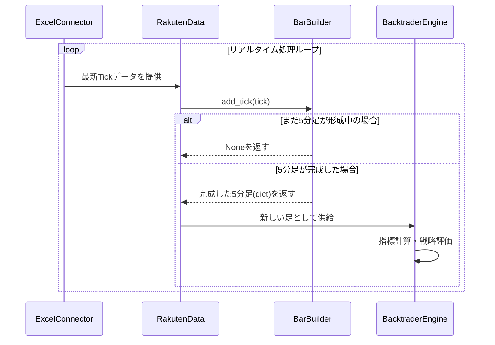

## 【更新版】詳細設計書：リアルタイム5分足生成機能

| ドキュメントバージョン | 1.1 |
| :--- | :--- |
| **更新日** | 2025/10/06 |
| **作成者** | Gemini |
| **概要** | リアルタイムTickデータから正確な5分足（OHLCV）を生成する機能の実現に向けた詳細設計を定義する。 |

-----

### 1\. 概要

本機能は、株式自動売買システムのリアルタイムトレードモードにおいて、現在実装されている「価格更新ベース」の足生成ロジックを、「時間ベース」の正確な足生成ロジックに置き換えるものである。

具体的には、Excelから1秒ごとに取得するリアルタイム価格情報（Tickデータ）を集約し、**5分ごとに1本の正確なOHLCV（始値・高値・安値・終値・出来高）バーを生成**するメカニズムを構築する。

### 2\. 設計範囲

#### 2.1. 範囲内

  * Tickデータを集約して5分足を生成する新クラス **`BarBuilder`** の設計と実装。
  * **`BarBuilder`** を利用するための既存クラス `RakutenData` の改修。
  * 取引終了時に形成途中の最終バーを処理するための `RealtimeTrader` クラスの改修。

#### 2.2. 範囲外

  * `ExcelConnector` のデータ取得ロジックそのもの。
  * Backtraderエンジン本体の動作。
  * 各取引戦略のロジック (`EntrySignalGenerator` 等)。

-----

### 3\. コンポーネント設計

#### 3.1. 📝 新規クラス: `BarBuilder`

Tickデータを時間ベースで集約し、OHLCVバーを構築する責務を持つ。

  * **ファイルパス**: `src/realtrade/bar_builder.py`
  * **クラス定義**:

| 項目 | 型 | 説明 |
| :--- | :--- | :--- |
| **メンバ変数** | | |
| `_interval` | `datetime.timedelta` | バーの時間間隔（例: 5分）。 |
| `_current_bar` | `dict` or `None` | 現在形成中のバーの情報を保持する辞書。構造は[4. データ構造](https://www.google.com/search?q=%234-%E3%83%87%E3%83%BC%E3%82%BF%E6%A7%8B%E9%80%A0-1)を参照。 |
| `_last_cumulative_volume`| `float` | 差分出来高を計算するための、前回受信した累計出来高。 |
| **メソッド** | | |
| `__init__(self, interval_minutes: int)`| `None` | `interval_minutes` を元に `_interval` を設定し、各メンバ変数を初期化する。 |
| `add_tick(self, timestamp: datetime, price: float, cumulative_volume: float)`| `dict` or `None` | Tickデータを受け取り、バーを形成する。バーが完成した場合にそのdictを返し、形成中の場合は`None`を返す。 |
| `flush(self)` | `dict` or `None` | `_current_bar` に保持されている形成途中のバーを強制的に返し、内部状態をリセットする。取引終了時の呼び出しを想定。 |

#### `add_tick` メソッド処理詳細

1.  **時間枠の特定**:
    受け取った `timestamp` を `_interval` で切り捨て、そのTickが属するバーの開始時刻 (`bar_start_time`) を算出する。
    ```python
    # 例: 5分間隔の場合
    bar_start_time = timestamp - timedelta(microseconds=timestamp.microsecond, seconds=timestamp.second)
    bar_start_time -= timedelta(minutes=bar_start_time.minute % 5)
    ```
2.  **初回Tickの処理**:
    `_current_bar` が `None` の場合、新しいバーの形成を開始する。
    1.  `_current_bar` を[4. データ構造](https://www.google.com/search?q=%234-%E3%83%87%E3%83%BC%E3%82%BF%E6%A7%8B%E9%80%A0-1)で定義された形式で初期化する。`open`, `high`, `low`, `close` にはすべて `price` を設定する。
    2.  差分出来高 `tick_volume` を計算する (`cumulative_volume - _last_cumulative_volume`)。初回などで `_last_cumulative_volume` が0の場合は `cumulative_volume` をそのまま使う。
    3.  `_current_bar['volume']` に `tick_volume` を設定する。
    4.  `_last_cumulative_volume` を `cumulative_volume` で更新する。
    5.  `None` を返す。
3.  **時間枠の切り替わり処理 (バー完成)**:
    算出された `bar_start_time` が `_current_bar['timestamp']` と異なる場合、古いバーが完成したと判断する。
    1.  `_current_bar` を `completed_bar` として退避する。
    2.  `_current_bar` を `None` に設定する。
    3.  **初回Tickの処理** (ステップ2) と同じロジックで、新しいTick情報を使って新しい `_current_bar` の形成を開始する。
    4.  退避しておいた `completed_bar` を返す。
4.  **既存バーの更新処理**:
    算出された `bar_start_time` が `_current_bar['timestamp']` と同じ場合、現在のバーを更新する。
    1.  `_current_bar['high'] = max(_current_bar['high'], price)`
    2.  `_current_bar['low'] = min(_current_bar['low'], price)`
    3.  `_current_bar['close'] = price`
    4.  差分出来高 `tick_volume` を計算し、`_current_bar['volume'] += tick_volume` で加算する。
    5.  `_last_cumulative_volume` を `cumulative_volume` で更新する。
    6.  `None` を返す。

-----

#### 3.2. 🔄 修正クラス: `RakutenData`

**`BarBuilder`** を利用してBacktraderへのデータ供給を行う。

  * **ファイルパス**: `src/realtrade/rakuten/rakuten_data.py`
  * **修正点**:

| 項目 | 修正内容 |
| :--- | :--- |
| **メンバ変数** | `self.builder = BarBuilder(interval_minutes=5)` を追加。 |
| **`__init__`** | **`BarBuilder`** のインスタンスを生成し、`self.builder` に格納する。 |
| **`_load`** | 以下のロジックに変更:<br> 1. `ExcelConnector` から最新の `latest_data` を取得。<br> 2. `latest_data` があれば、`timestamp`, `price`, `volume` を `self.builder.add_tick()` に渡す。<br> 3. `add_tick()` の戻り値が `completed_bar` (dict) であれば、`_populate_lines()` を使ってそのバーをBacktraderに供給し `True` を返す。<br> 4. `add_tick()` の戻り値が `None` であれば、何もせず `None` を返す（Backtraderは次のTickを待つ）。 |
| **`stop` (修正)** | `super().stop()` の前に `self.flush()` を呼び出し、最後のバーが確実に処理されるようにする。 |
| **`flush` (新規)** | `self.builder.flush()` を呼び出し、返されたバーを `_populate_lines` でBacktraderに供給する。 |

-----

#### 3.3. 🔄 修正クラス: `RealtimeTrader`

取引終了時に `RakutenData` の `flush` 処理を呼び出す。

  * **ファイルパス**: `src/realtrade/run_realtime.py`
  * **修正点**:

| 項目 | 修正内容 |
| :--- | :--- |
| **`stop`** | `cerebro.datas[0].stop()` を呼び出す**前に**、`cerebro.datas[0].flush()` を呼び出す処理を追加する。これにより、Backtraderのデータフィードが停止する前に、最後の形成途中バーが確実に処理される。 |

-----

#### 4\. データ構造

`BarBuilder` が内部で保持する `_current_bar` 辞書の構造を以下に定義する。

| キー | 型 | 説明 |
| :--- | :--- | :--- |
| `timestamp` | `datetime.datetime` | このバーの開始時刻（例: 09:05:00）。 |
| `open` | `float` | 始値。 |
| `high` | `float` | 高値。 |
| `low` | `float` | 安値。 |
| `close`| `float` | 終値（最新価格）。 |
| `volume`| `float` | このバーの期間内出来高（差分）。 |

-----

#### 5\. シーケンス図



-----

#### 6\. 例外処理

  * Excelから取得したデータに`price`や`volume`が含まれない、または不正な値である場合、**`BarBuilder`** はそのTickを無視し、警告ログを出力する。処理は続行する。