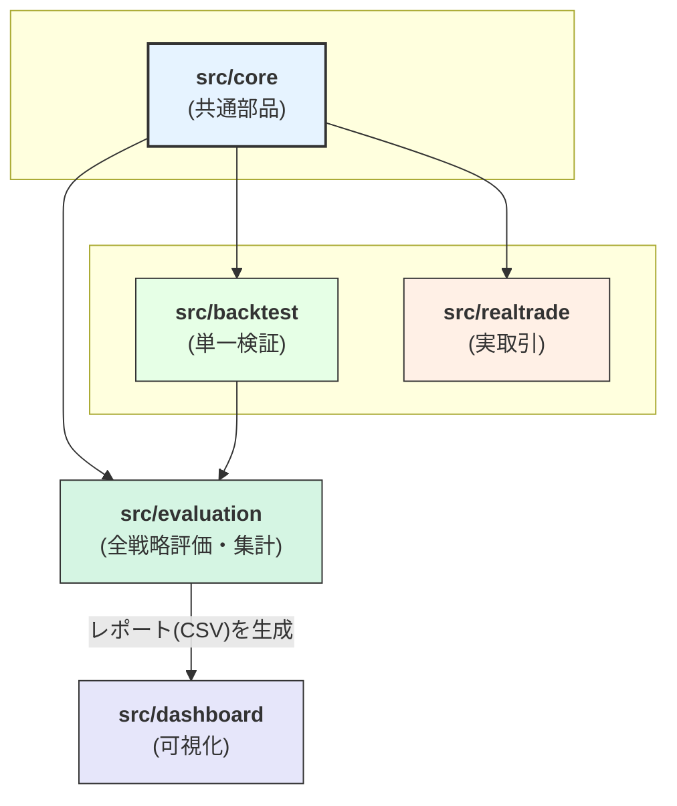

### リファクタリング提案：責務分離による新しいプロジェクト構成

現在のシステムを、責務が明確なコンポーネント群に分離するための、新しいディレクトリ構造とファイル配置を提案します。

#### 1. 提案する新しいディレクトリ構造

`src` ディレクトリ以下に、責務の異なるパッケージ群を配置します。

```plaintext
/ (プロジェクトルート)
|
|-- results/
|   |-- backtest/
|   +-- evaluation/             # (旧 all_strategies)
|
|-- data/
|   |-- 1332_D_2024.csv         # 銘柄コード_日足_年.csv
|   |-- 7203_60m_2025.csv       # 銘柄コード_60分足_年.csv
|   +-- 9984_5m_2025-06.csv     # 銘柄コード_5分足_年月.csv
|
|-- log/
|   |-- backtest_2025-07-03-153000.log
|   |-- realtime_2025-07-03.log
|   +-- evaluation_2025-07-03-154500.log
|
|-- config/
|   |-- strategy_base.yml
|   |-- strategy_catalog.yml
|   +-- email_config.yml
|
|-- src/
|   |-- core/                  # ★【共通部品】
|   |   |-- __init__.py
|   |   |-- strategy.py
|   |   |-- indicators.py
|   |   +-- util/
|   |       |-- __init__.py
|   |       |-- logger.py
|   |       +-- notifier.py
|   |
|   |-- backtest/              # ★【単一バックテスト部品】
|   |   |-- __init__.py
|   |   |-- run_backtest.py
|   |   |-- config_backtest.py
|   |   +-- report.py
|   |
|   |-- realtrade/             # ★【リアルタイム部品】
|   |   |-- __init__.py
|   |   |-- run_realtrade.py
|   |   |-- config_realtrade.py
|   |   |-- state_manager.py
|   |   |-- analyzer.py
|   |   |-- live/
|   |   +-- mock/
|   |
|   |-- dashboard/             # ★【可視化ツール部品】
|   |   |-- __init__.py
|   |   |-- app.py
|   |   |-- chart.py
|   |   +-- templates/
|   |
|   +-- evaluation/            # ★【全戦略評価・集計部品】
|       |-- __init__.py
|       |-- run_evaluation.py   # 全評価プロセスの実行スクリプト
|       |-- orchestrator.py     # 全戦略のループ実行を管理
|       +-- aggregator.py       # 全戦略レポートの集計・統合
|
|-- requirements.txt
+-- .env
```

#### 1.1. 設定ファイル名の変更提案

| 旧ファイル名 | 新ファイル名案 | 役割と変更理由 |
| :--- | :--- | :--- |
| `strategy.yml` | **`strategy_base.yml`** | バックテストとリアルタイムで共通の基本設定であることを明確化。 |
| `strategies.yml` | **`strategy_catalog.yml`** | 複数のエントリー戦略を定義したカタログであることを明確化。 |

#### 1.2. 実行関連ファイル名の変更提案

| 対象 | 旧名称 | 新名称案（推奨） | 理由 |
| :--- | :--- | :--- | :--- |
| **パッケージ** | `run_all_strategies.py` | **`evaluation`** | **「評価」**という行為そのものを指す、簡潔で的確な名称。このパッケージ内に実行スクリプトも含まれる。 |

---

#### 2. 各コンポーネントの役割と依存関係



**A. `src/core` (共通部品)**
* **目的**: 他の全ての部品から利用される、システムの心臓部。

**B. `src/backtest` (単一バックテスト部品)**
* **目的**: 単一のバックテストの実行と、その結果レポートの生成に特化。

**C. `src/realtrade` (リアルタイム部品)**
* **目的**: ライブ取引の実行に特化。

**D. `src/dashboard` (可視化ツール部品)**
* **目的**: バックテスト結果やリアルタイムの稼働状況を可視化するWebアプリケーション。

**E. `src/evaluation` (全戦略評価・集計部品)**
* **目的**: 複数のバックテストを連続実行し、その結果を評価・統合・分析する。実行スクリプト(`run_evaluation.py`)を含む。

#### 3. リファクタリングの主なメリット

1.  **責務の更なる明確化**: 各パッケージの役割が「共通ロジック」「単一検証」「実取引」「可視化」「全戦略評価」と、より明確に分離されます。
2.  **凝集度の向上**: 密接に関連する「全戦略実行」と「レポート集計」のロジックが同一パッケージ内に配置されることで、コードの凝集度が高まります。
3.  **移植性の向上**: `src`ディレクトリをコピーするだけで、全てのソースコードを他の環境に持っていくことが可能になります。

---

この構成案でよろしければ、承認の旨をお知らせください。
承認いただけましたら、この最終的なディレクトリ構造案に基づき、具体的なファイル移動とコード修正のステップに進みます。
